# 北京市二手房价格预测分析 

## 背景介绍

- 北京市房地产市场是我国房地产市场中最为发达，也是最具有代表性的房地产市场之一。
- 什么样的因素影响着北京市商品房的销售价格？
- 价格上的巨大差异又是如何产生的？
- 本案例通过北京城内六区16142套在售二手房相关数据，通过经典的线性回归分析建立了二手房价格预测模型

## 目录

- 数据来源
- 数据清洗
- 描述性分析
    - 区位因素：城区、地铁、学区
    - 内部因素：卧室数、客厅数、面积、楼层
- 数据建模
    - 简单线性模型：解读->诊断->模型改进
    - 对数线性模型：解读->关心位置因素->城区与学区交互
    - 带有交叉项的模型：模型解读
- 预测
- 结论和建议

## 数据来源和说明

### 数据来源

- 数据来自某二手房中介网站
- 2016年5月，北京在售二手房的相关数据
- 样本量n=16142

### 字段说明

- price:每平米均价(元)，2016年5月在售二手房每平米单价
- CATE：东城、西城、朝阳、海淀、丰台、石景山
- bedrooms：卧室数，即为3室2厅中的“3室”
- halls：厅总数，即为3室2厅中的“2厅”
- AREA：房屋总面积
- Floor：basement/low/middle/high  分别为地下室，低楼层，中楼层，高楼层
- subway：是否地铁沿线
- school：是否为学区房
- LONG：所在小区的经度
- LAT：所在小区的纬度
- NAME：小区名称，如（南曦大厦）
- DISTRICT：区域名称，如（木樨园）

## 数据清洗

### 数据导入

```{r}
setwd('/home/wenshuigen/git/CaseAnalytics/北京二手房价格预测/')
dat <- read.csv('二手房.csv', header = T)
str(dat)

## `ta.frame':    16795 obs. of  12 variables:
##  $ CATE    : Factor w/ 6 levels "chaoyang","dongcheng",..: 1 1 4 4 3 3 4 4 4 3 ...
##  $ bedrooms: int  1 1 5 3 2 2 2 2 2 2 ...
##  $ halls   : int  0 1 2 2 1 1 1 1 1 2 ...
##  $ AREA    : num  46.1 59.1 278.9 207 53.3 ...
##  $ floor   : Factor w/ 4 levels "basement ","high",..: 4 4 2 2 3 3 3 4 4 4 ...
##  $ subway  : int  1 1 1 1 1 1 1 1 1 1 ...
##  $ school  : int  0 0 1 1 1 1 1 1 1 0 ...
##  $ price   : int  48850 46540 71662 57972 71268 70690 57348 55179 45591 73585 ...
##  $ LONG    : num  116 116 116 116 116 ...
##  $ LAT     : num  39.9 39.9 40 40 39.9 ...
##  $ NAME    : Factor w/ 3034 levels "10AM新坐标","10号名邸",..: 1 1 2 2 3 3 4 4 4 5 ...
##  $ DISTRICT: Factor w/ 173 levels "CBD","安定门",..: 45 45 172 172 99 99 103 103 103 88 ...
```

```{r}
head(dat)

##       CATE bedrooms halls   AREA  floor subway school price     LONG
## 1 chaoyang        1     0  46.06 middle      1      0 48850 116.4597
## 2 chaoyang        1     1  59.09 middle      1      0 46540 116.4597
## 3  haidian        5     2 278.95   high      1      1 71662 116.3036
## 4  haidian        3     2 207.00   high      1      1 57972 116.3036
## 5  fengtai        2     1  53.32    low      1      1 71268 116.4188
## 6  fengtai        2     1  58.00    low      1      1 70690 116.4188
##        LAT       NAME DISTRICT
## 1 39.92835 10AM新坐标     方庄
## 2 39.92835 10AM新坐标     方庄
## 3 39.95481   10号名邸   紫竹桥
## 4 39.95481   10号名邸   紫竹桥
## 5 39.94381   17号旁门   蒲黄榆
## 6 39.94381   17号旁门   蒲黄榆
```

```{r}
dat[, c(2,3,6,7)] <- as.data.frame(apply(dat[, c(2,3,6,7)], 2, as.factor)) #将2,3,6,7列转化为因子型变量
summary(dat) #数据概述可以看出，在考虑现实情况下很多字段存在异常值

##           CATE         bedrooms    halls          AREA         
##  chaoyang   :2915   2      :8070   0:  988   Min.   :    7.80  
##  dongcheng  :2944   3      :4301   1:11267   1st Qu.:   59.94  
##  fengtai    :3003   1      :3445   2: 4399   Median :   78.70  
##  haidian    :3001   4      : 746   3:  135   Mean   :   95.81  
##  shijingshan:2040   5      : 154   4:    5   3rd Qu.:  112.08  
##  xicheng    :2892   6      :  52   9:    1   Max.   :18779.50  
##                     (Other):  27                               
##        floor      subway    school        price             LONG      
##  basement : 191   0: 2876   0:11739   Min.   :  5496   Min.   :106.0  
##  high     :5677   1:13919   1: 5056   1st Qu.: 42701   1st Qu.:116.3  
##  low      :5260                       Median : 57523   Median :116.4  
##  middle   :5667                       Mean   : 61266   Mean   :116.4  
##                                       3rd Qu.: 76336   3rd Qu.:116.4  
##                                       Max.   :206667   Max.   :123.9  
##                                                                       
##       LAT                NAME          DISTRICT    
##  Min.   :22.34   远洋山水  :  215   鲁谷   :  986  
##  1st Qu.:39.89   荣丰2008  :  121   马甸   :  426  
##  Median :39.92   裕中西里  :  104   望京   :  414  
##  Mean   :39.89   裕中东里  :   96   苹果园 :  409  
##  3rd Qu.:39.96   远洋沁山水:   82   广安门 :  386  
##  Max.   :41.84   永乐东区  :   81   广渠门 :  368  
##                  (Other)   :16096   (Other):13806
```

### 删除异常值

```{r}
apply(dat[,c(1,2,3,5)], 2, table)

## $CATE
## 
##    chaoyang   dongcheng     fengtai     haidian shijingshan     xicheng 
##        2915        2944        3003        3001        2040        2892 
## 
## $bedrooms
## 
##    0    1    2    3    4    5    6    7    8    9 
##    4 3445 8070 4301  746  154   52   13    4    6 
## 
## $halls
## 
##     0     1     2     3     4     9 
##   988 11267  4399   135     5     1 
## 
## $floor
## 
## basement       high       low    middle 
##       191      5677      5260      5667
```

```{r}
dat <- dat[!(dat$bedrooms %in% c(0,6,7,8,9)), ] #卧室数0,6,7,8,9的观测很少，考虑删除
dat <- dat[!(dat$halls %in% c(4,9)), ] #客厅数4,9的观测很少，考虑删除
dat <- dat[dat$floor != 'basement ', ] #地下室的观测数少，我们可以做删除处理
```

### 房屋面积分布

```{r}
quantile(dat$AREA) #从数据可以看出，有异常值出现，不太符合现实情况

##       0%      25%      50%      75%     100% 
##     7.80    60.00    78.80   111.76 18779.50
````

```{r}
quantile(dat$AREA, probs = c(0.01,0.99)) #查看1%和99%的分位数

##       1%      99% 
##  33.9825 284.9775
```

```{r}
dat <- dat[dat$AREA>34 & dat$AREA<300, ] #删除房屋面积小于30或者大于300平米的观测值
```

### 房价分布

```{r}
quantile(dat$price) #有许多异常值

##        0%       25%       50%       75%      100% 
##  18348.00  42771.25  57376.50  75958.25 182223.00
```

```{r}
quantile(dat$price, probs = c(0.001,0.999)) #查看0.1%和99.9%的分位数

##     0.1%    99.9% 
##  21569.1 144945.4
```

```{r}
dat <- dat[dat$price>21000 & dat$price<150000, ]
```

### 北京经纬度取值范围

```{r}
dat <- dat[dat$LONG>=115.5 & dat$LONG <= 117.5, ] #经度115.5~117.5
dat <- dat[dat$LAT>=39.5 & dat$LAT <= 41, ] #纬度39.5~41
```

### 是否临近地铁

```{r}
prop.table(table(dat$subway)) #82.8%的观测临近地铁

##         0         1 
## 0.1720976 0.8279024
```

### 是否为学区房

```{r}
prop.table(table(dat$school)) #30.4%的观测是学区房

##         0         1 
## 0.6961343 0.3038657
```

### 保存清洗后的数据

```{r}
write.csv(dat, file='mydata.csv',row.names = F)
```

## 描述性分析

### 数据导入

```{r}
dat <- read.csv('mydata.csv', header = T)
str(dat)

## 'data.frame':    16142 obs. of  12 variables:
##  $ CATE    : Factor w/ 6 levels "chaoyang","dongcheng",..: 1 1 4 4 3 3 4 4 4 3 ...
##  $ bedrooms: int  1 1 5 3 2 2 2 2 2 2 ...
##  $ halls   : int  0 1 2 2 1 1 1 1 1 2 ...
##  $ AREA    : num  46.1 59.1 278.9 207 53.3 ...
##  $ floor   : Factor w/ 3 levels "high","low","middle": 3 3 1 1 2 2 2 3 3 3 ...
##  $ subway  : int  1 1 1 1 1 1 1 1 1 1 ...
##  $ school  : int  0 0 1 1 1 1 1 1 1 0 ...
##  $ price   : int  48850 46540 71662 57972 71268 70690 57348 55179 45591 73585 ...
##  $ LONG    : num  116 116 116 116 116 ...
##  $ LAT     : num  39.9 39.9 40 40 39.9 ...
##  $ NAME    : Factor w/ 2951 levels "10AM新坐标","10号名邸",..: 1 1 2 2 3 3 4 4 4 5 ...
##  $ DISTRICT: Factor w/ 173 levels "CBD","安定门",..: 45 45 172 172 99 99 103 103 103 88 ...
```

```{r}
head(dat)

##       CATE bedrooms halls   AREA  floor subway school price     LONG
## 1 chaoyang        1     0  46.06 middle      1      0 48850 116.4597
## 2 chaoyang        1     1  59.09 middle      1      0 46540 116.4597
## 3  haidian        5     2 278.95   high      1      1 71662 116.3036
## 4  haidian        3     2 207.00   high      1      1 57972 116.3036
## 5  fengtai        2     1  53.32    low      1      1 71268 116.4188
## 6  fengtai        2     1  58.00    low      1      1 70690 116.4188
##        LAT       NAME DISTRICT
## 1 39.92835 10AM新坐标     方庄
## 2 39.92835 10AM新坐标     方庄
## 3 39.95481   10号名邸   紫竹桥
## 4 39.95481   10号名邸   紫竹桥
## 5 39.94381   17号旁门   蒲黄榆
## 6 39.94381   17号旁门   蒲黄榆
```

```{r}
#将bedrooms,halls,subway和school字段转化为因子类型数据
dat[, c(2,3,6,7)] <- as.data.frame(apply(dat[, c(2,3,6,7)], 2, as.factor)) 
summary(dat)

##           CATE      bedrooms halls          AREA           floor     
##  chaoyang   :2864   1:3154   0:  788   Min.   : 34.02   high  :5529  
##  dongcheng  :2768   2:7963   1:11040   1st Qu.: 60.20   low   :5058  
##  fengtai    :2938   3:4249   2: 4229   Median : 79.00   middle:5555  
##  haidian    :2917   4: 674   3:   85   Mean   : 91.96                
##  shijingshan:1936   5: 102             3rd Qu.:110.81                
##  xicheng    :2719                      Max.   :299.00                
##                                                                      
##  subway    school        price             LONG            LAT       
##  0: 2778   0:11237   Min.   : 21053   Min.   :116.0   Min.   :39.66  
##  1:13364   1: 4905   1st Qu.: 42817   1st Qu.:116.3   1st Qu.:39.89  
##                      Median : 57422   Median :116.4   Median :39.92  
##                      Mean   : 61118   Mean   :116.4   Mean   :39.93  
##                      3rd Qu.: 76010   3rd Qu.:116.4   3rd Qu.:39.96  
##                      Max.   :149871   Max.   :117.1   Max.   :40.48  
##                                                                      
##            NAME          DISTRICT    
##  远洋山水    :  187   鲁谷   :  916  
##  裕中西里    :  104   马甸   :  418  
##  裕中东里    :   94   望京   :  409  
##  永乐东区    :   81   苹果园 :  400  
##  海特花园小区:   73   广渠门 :  365  
##  新景家园东区:   62   崇文门 :  315  
##  (Other)     :15541   (Other):13319
```

在分析之前，将CATE和floor字段的取值换成中文，以便作图输出美观

```{r}
dict1 <- levels(dat$CATE)
dict2 <- c('朝阳','东城','丰台','海淀','石景山','西城')
dat$CATE <- as.factor(dict2[match(dat$CATE, dict1)])

dict3 <- levels(dat$floor)
dict4 <- c('高','低','中')
dat$floor <- as.factor(dict4[match(dat$floor, dict3)])
```

### 北京市场二手房房价分布图

```{r}
dat$price <- dat$price/10000  #单位转化为万元
library(ggplot2)
ggplot(dat, aes(x=price)) + 
  geom_histogram(bins=13, fill='lightblue', color='black') + 
  theme(axis.text.x=element_text(size=rel(1.5)), axis.text.y=element_text(size=rel(1.5)),
        axis.title.x=element_text(size=rel(1.5)), axis.title.y=element_text(size=rel(1.5)),
        plot.title=element_text(size=rel(2), color='red')) +
  labs(x='单位面积房价(万元/平方米)', y='频数', title='2016年5月北京市二手房单价分布图') +
  scale_x_continuous(breaks=c(2:15))
```

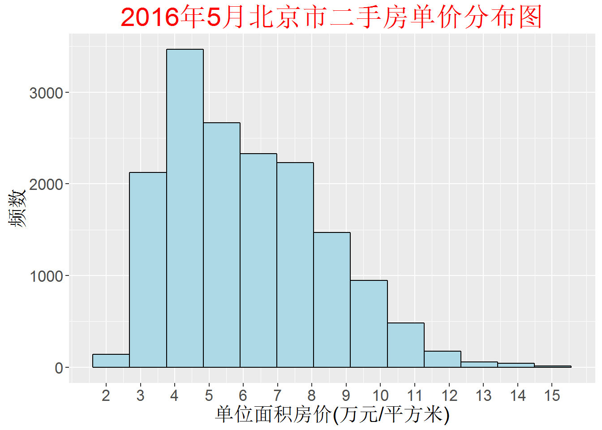

```{r}
dat[which.max(dat$price), ] #求出房价最高的观测值
dat[which.min(dat$price), ] #求出房价最低的观测值

##       CATE bedrooms halls AREA floor subway school  price     LONG
## 12351 丰台        4     2  171    高      0      0 2.1053 116.2481
##            LAT       NAME DISTRICT
## 12351 39.84295 晓月苑三里   卢沟桥
```

- **最高14.99万/平方米：**来自西城区金融街新文化街小区的一套一室三厅，总面积77.4平米，低楼层，临近地铁，非学区房
- **最低2.1万/平方米：**来自丰台区卢沟桥晓月苑三里小区的一套四室二厅，总面积171平米，高楼层，不临近地铁，非学区房

### 六大城区对房价的分组箱线图

```{r}
ggplot(dat, aes(x=CATE,y=price)) + 
  geom_boxplot(fill='lightblue') +
  theme(axis.text.x=element_text(size=rel(1.5)), axis.text.y=element_text(size=rel(1.5)),
        axis.title.x=element_text(size=rel(1.5)), axis.title.y=element_text(size=rel(1.5)),
        plot.title=element_text(size=rel(2), color='red')) +
  labs(x='城区', y='单位面积房价(万元)', title='2016年5月北京市六大城区二手房单价分布图') +
  scale_x_discrete(limits=c('石景山','丰台','朝阳','东城','海淀','西城'))
```

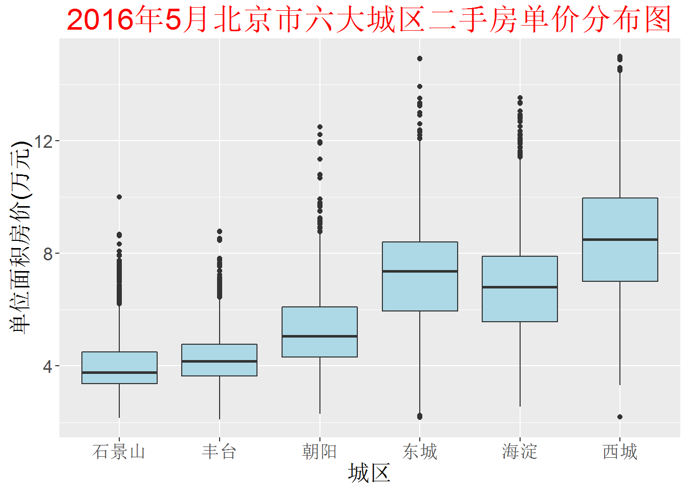

由图可知，六大城区的二手房单价大致可以分为两组：

- 第一组为石景山、丰台、朝阳，单价相差不多，朝阳相对来说高单价的会更多些。
- 第二组为东城、海淀、西城，组内单价相差不大，但相对第一组来说单价高了很多。

### 卧室数对房价的分组箱线图

```{r}
ggplot(dat, aes(x=bedrooms,y=price)) +
  geom_boxplot(fill='lightblue') +
  theme(axis.text.x=element_text(size=rel(1.5)), axis.text.y=element_text(size=rel(1.5)),
        axis.title.x=element_text(size=rel(1.5)), axis.title.y=element_text(size=rel(1.5)),
        plot.title=element_text(size=rel(2), color='red')) +
  labs(x='卧室数', y='单位面积房价(万元)',   title='卧室数与二手房单价之间的分布图') 
```

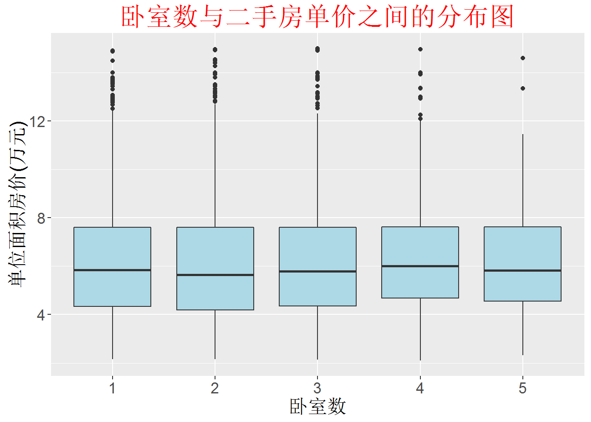


由图可知，卧室数对整个二手房的单价影响不大。

### 厅数对房价的分组箱线图

```{r}
ggplot(dat, aes(x=halls,y=price)) +
  geom_boxplot(fill='lightblue') +
  theme(axis.text.x=element_text(size=rel(1.5)), axis.text.y=element_text(size=rel(1.5)),
        axis.title.x=element_text(size=rel(1.5)), axis.title.y=element_text(size=rel(1.5)),
        plot.title=element_text(size=rel(2), color='red')) +
  labs(x='厅数', y='单位面积房价(万元)', title='厅数与二手房单价之间的分布图')
```

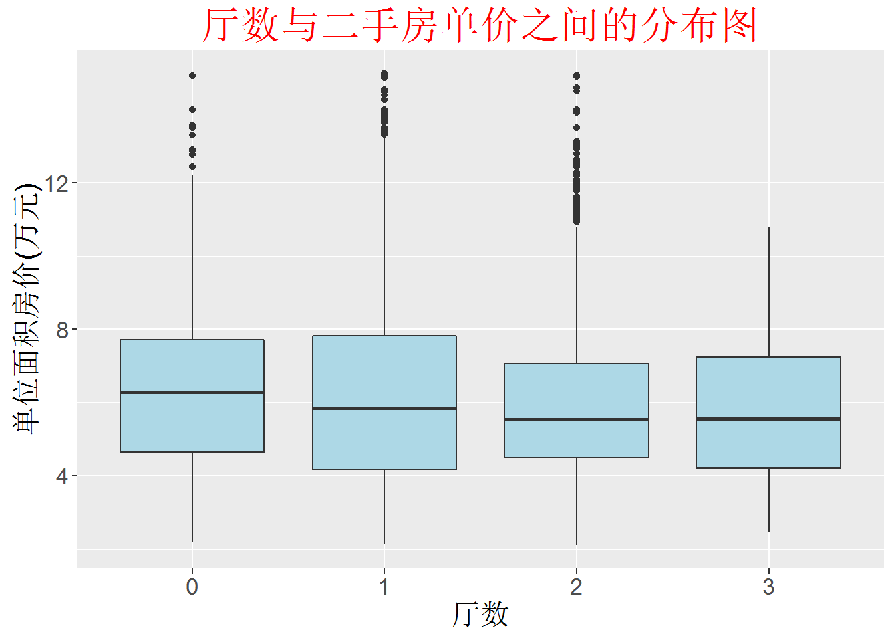


由图可知，厅数越少，单位面积的房价越高

### 楼层对房价的分组箱线图

```{r}
ggplot(dat, aes(x=floor,y=price)) +
  geom_boxplot(fill='lightblue') +
  theme(axis.text.x=element_text(size=rel(1.5)), axis.text.y=element_text(size=rel(1.5)),
        axis.title.x=element_text(size=rel(1.5)), axis.title.y=element_text(size=rel(1.5)),
        plot.title=element_text(size=rel(2), color='red')) +
  labs(x='楼层', y='单位面积房价(万元)', title='楼层与二手房单价之间的分布图') + 
  scale_x_discrete(limits=c('低','中','高'))
```

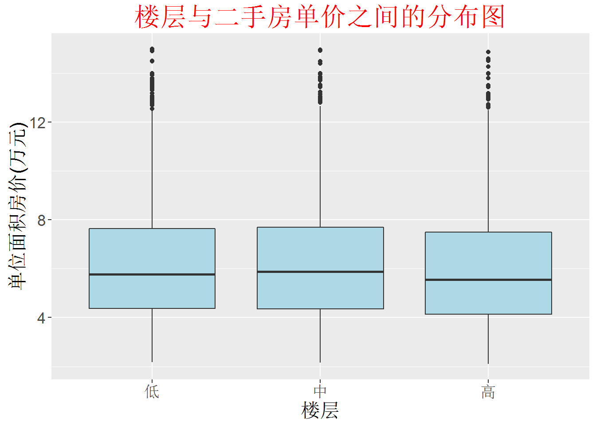


不同楼层的单位面积房价差异并不明显

### 是否临近地铁对房价的分组箱线图

```{r}
ggplot(dat, aes(x=subway,y=price)) +
  geom_boxplot(fill='lightblue') +
  theme(axis.text.x=element_text(size=rel(1.5)), axis.text.y=element_text(size=rel(1.5)),
        axis.title.x=element_text(size=rel(1.5)), axis.title.y=element_text(size=rel(1.5)),
        plot.title=element_text(size=rel(2), colour = 'red')) +
  labs(x='临近地铁', y='单位面积房价(万元)', title='地铁房的单价分布图') +
  scale_x_discrete(labels = c('否', '是'))
```

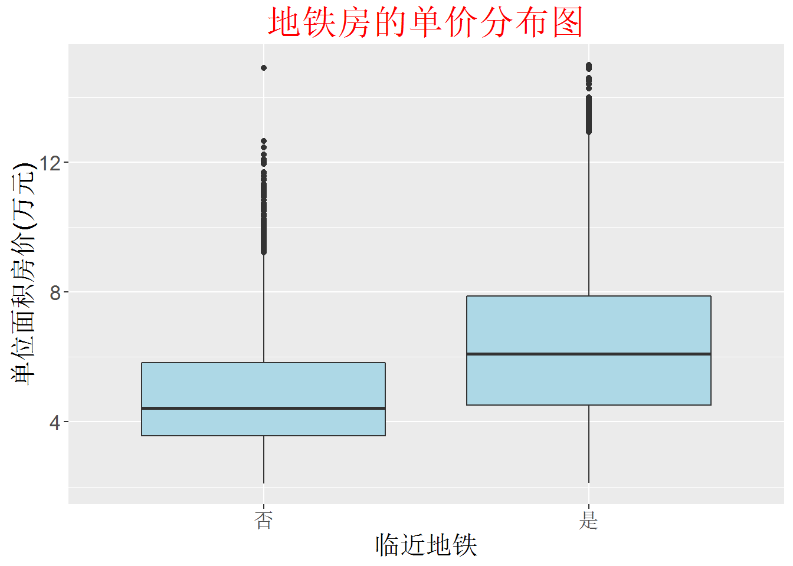

### 是否学区房对房价的分组箱线图

```{r}
ggplot(dat, aes(x=school,y=price)) +
  geom_boxplot(fill='lightblue') +
  theme(axis.text.x=element_text(size=rel(1.5)), axis.text.y=element_text(size=rel(1.5)),
        axis.title.x=element_text(size=rel(1.5)), axis.title.y=element_text(size=rel(1.5)),
        plot.title=element_text(size=rel(2), colour = 'red')) +
  labs(x='学区房', y='单位面积房价(万元)', title='学区房的单价分布图') +
  scale_x_discrete(labels = c('否', '是'))
```

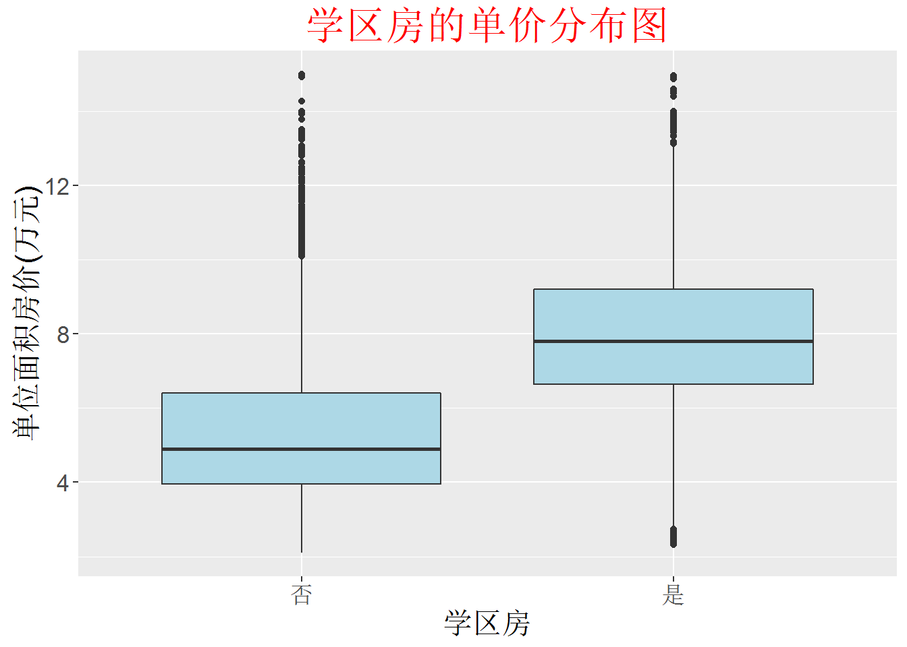

毋庸置疑，地铁房和学区房的单位面积房价都很高。

## 统计建模

### 模型建立

综合前面的描述统计分析，我们建立线性回归模型

```{r}
modeldata <- dat[,1:8]
dummvar <- model.matrix(price~.,modeldata)
modeldata <- cbind(dummvar[,-1],modeldata$price)
colnames(modeldata) <- c('CATE_dc','CATE_ft','CATE_hd','CATE_sjs','CATE_sc','bedrooms2',
                         'bedrooms3','bedrooms4','bedrooms5','halls1','halls2','halls3',
                         'AREA','floor_high','floor_medium','subway','school','price')
modeldata <- as.data.frame(modeldata)
lm1.sol <- lm(price~., data=modeldata)
summary(lm1.sol)
```

从回归诊断图来看，随着预测值得增大，残差的波动也随之增大，也即存在“异方差”。

```{r}
par(mfrow=c(2,2))
plot(lm1.sol)
```

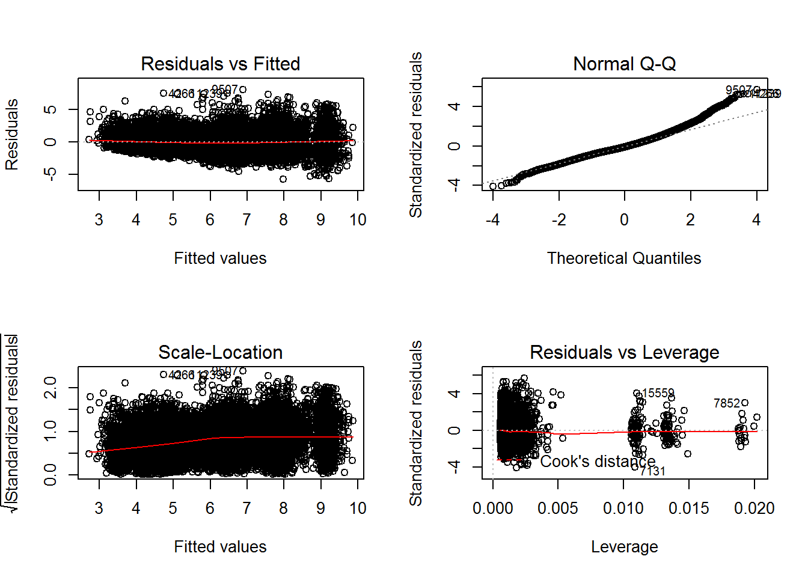

### 对数线性模型

由于前面建立的模型存在“异方差”现象，不满足回归假设。现在我们对因变量(单位面积房价)取对数，建立对数线性模型

```{r}
lm2.sol <- lm(log(price)~., data=modeldata)
summary(lm2.sol)

## 
## Call:
## lm(formula = log(price) ~ ., data = modeldata)
## 
## Residuals:
##      Min       1Q   Median       3Q      Max 
## -1.25643 -0.14282 -0.00239  0.14654  1.00250 
## 
## Coefficients:
##                Estimate Std. Error t value Pr(>|t|)    
## (Intercept)   1.523e+00  1.124e-02 135.456  < 2e-16 ***
## CATE_dc       2.667e-01  6.191e-03  43.085  < 2e-16 ***
## CATE_ft      -1.545e-01  6.018e-03 -25.664  < 2e-16 ***
## CATE_hd       2.348e-01  6.098e-03  38.506  < 2e-16 ***
## CATE_sjs     -1.953e-01  6.893e-03 -28.336  < 2e-16 ***
## CATE_sc       4.332e-01  6.358e-03  68.136  < 2e-16 ***
## bedrooms2     5.973e-03  5.054e-03   1.182 0.237291    
## bedrooms3     2.488e-02  6.640e-03   3.748 0.000179 ***
## bedrooms4     6.655e-02  1.272e-02   5.231 1.71e-07 ***
## bedrooms5     1.004e-01  2.513e-02   3.996 6.47e-05 ***
## halls1        2.708e-02  8.613e-03   3.144 0.001669 ** 
## halls2        1.299e-01  1.008e-02  12.892  < 2e-16 ***
## halls3        1.524e-01  2.715e-02   5.613 2.02e-08 ***
## AREA         -1.086e-03  7.219e-05 -15.041  < 2e-16 ***
## floor_high   -3.408e-02  4.382e-03  -7.777 7.86e-15 ***
## floor_medium -8.390e-03  4.365e-03  -1.922 0.054641 .  
## subway        1.309e-01  4.876e-03  26.845  < 2e-16 ***
## school        1.730e-01  4.376e-03  39.527  < 2e-16 ***
## ---
## Signif. codes:  0 '***' 0.001 '**' 0.01 '*' 0.05 '.' 0.1 ' ' 1
## 
## Residual standard error: 0.2243 on 16124 degrees of freedom
## Multiple R-squared:  0.6177, Adjusted R-squared:  0.6173 
## F-statistic:  1533 on 17 and 16124 DF,  p-value: < 2.2e-16
```

从回归诊断图可以看到，“异方差”现象得到了很大改善。

```{r}
par(mfrow=c(2,2))
plot(lm2.sol)
```


#### 模型改进：逐步回归法

```{r}
lm2.step <- step(lm2.sol)
summary(lm2.step)

## Start:  AIC=-48232.85
## log(price) ~ CATE_dc + CATE_ft + CATE_hd + CATE_sjs + CATE_sc + 
##     bedrooms2 + bedrooms3 + bedrooms4 + bedrooms5 + halls1 + 
##     halls2 + halls3 + AREA + floor_high + floor_medium + subway + 
##     school
## 
##                Df Sum of Sq     RSS    AIC
## - bedrooms2     1     0.070  811.60 -48233
## <none>                       811.53 -48233
## - floor_medium  1     0.186  811.71 -48231
## - halls1        1     0.498  812.02 -48225
## - bedrooms3     1     0.707  812.23 -48221
## - bedrooms5     1     0.804  812.33 -48219
## - bedrooms4     1     1.377  812.90 -48207
## - halls3        1     1.586  813.11 -48203
## - floor_high    1     3.044  814.57 -48174
## - halls2        1     8.365  819.89 -48069
## - AREA          1    11.386  822.91 -48010
## - CATE_ft       1    33.150  844.68 -47589
## - subway        1    36.272  847.80 -47529
## - CATE_sjs      1    40.410  851.94 -47450
## - CATE_hd       1    74.624  886.15 -46815
## - school        1    78.635  890.16 -46742
## - CATE_dc       1    93.429  904.95 -46476
## - CATE_sc       1   233.662 1045.19 -44150
## 
## Step:  AIC=-48233.45
## log(price) ~ CATE_dc + CATE_ft + CATE_hd + CATE_sjs + CATE_sc + 
##     bedrooms3 + bedrooms4 + bedrooms5 + halls1 + halls2 + halls3 + 
##     AREA + floor_high + floor_medium + subway + school
## 
##                Df Sum of Sq     RSS    AIC
## <none>                       811.60 -48233
## - floor_medium  1     0.186  811.78 -48232
## - halls1        1     0.611  812.21 -48223
## - bedrooms5     1     0.737  812.33 -48221
## - bedrooms3     1     0.790  812.39 -48220
## - bedrooms4     1     1.379  812.97 -48208
## - halls3        1     1.623  813.22 -48203
## - floor_high    1     3.014  814.61 -48176
## - halls2        1     8.933  820.53 -48059
## - AREA          1    11.527  823.12 -48008
## - CATE_ft       1    33.116  844.71 -47590
## - subway        1    36.291  847.89 -47529
## - CATE_sjs      1    40.348  851.94 -47452
## - CATE_hd       1    74.832  886.43 -46812
## - school        1    78.942  890.54 -46737
## - CATE_dc       1    93.388  904.98 -46477
## - CATE_sc       1   233.828 1045.42 -44149

## 
## Call:
## lm(formula = log(price) ~ CATE_dc + CATE_ft + CATE_hd + CATE_sjs + 
##     CATE_sc + bedrooms3 + bedrooms4 + bedrooms5 + halls1 + halls2 + 
##     halls3 + AREA + floor_high + floor_medium + subway + school, 
##     data = modeldata)
## 
## Residuals:
##      Min       1Q   Median       3Q      Max 
## -1.25787 -0.14269 -0.00216  0.14638  0.99847 
## 
## Coefficients:
##                Estimate Std. Error t value Pr(>|t|)    
## (Intercept)   1.523e+00  1.123e-02 135.695  < 2e-16 ***
## CATE_dc       2.664e-01  6.184e-03  43.075  < 2e-16 ***
## CATE_ft      -1.544e-01  6.018e-03 -25.651  < 2e-16 ***
## CATE_hd       2.350e-01  6.095e-03  38.559  < 2e-16 ***
## CATE_sjs     -1.951e-01  6.891e-03 -28.313  < 2e-16 ***
## CATE_sc       4.333e-01  6.357e-03  68.160  < 2e-16 ***
## bedrooms3     1.967e-02  4.965e-03   3.962 7.45e-05 ***
## bedrooms4     6.005e-02  1.147e-02   5.234 1.68e-07 ***
## bedrooms5     9.344e-02  2.442e-02   3.826 0.000131 ***
## halls1        2.930e-02  8.406e-03   3.485 0.000493 ***
## halls2        1.320e-01  9.911e-03  13.323  < 2e-16 ***
## halls3        1.540e-01  2.712e-02   5.678 1.38e-08 ***
## AREA         -1.068e-03  7.055e-05 -15.134  < 2e-16 ***
## floor_high   -3.389e-02  4.379e-03  -7.738 1.07e-14 ***
## floor_medium -8.394e-03  4.365e-03  -1.923 0.054513 .  
## subway        1.309e-01  4.876e-03  26.852  < 2e-16 ***
## school        1.732e-01  4.373e-03  39.604  < 2e-16 ***
## ---
## Signif. codes:  0 '***' 0.001 '**' 0.01 '*' 0.05 '.' 0.1 ' ' 1
## 
## Residual standard error: 0.2243 on 16125 degrees of freedom
## Multiple R-squared:  0.6177, Adjusted R-squared:  0.6173 
## F-statistic:  1628 on 16 and 16125 DF,  p-value: < 2.2e-16
```

#### 回归诊断

```{r}
par(mfrow=c(2,2))
plot(lm2.step)
```

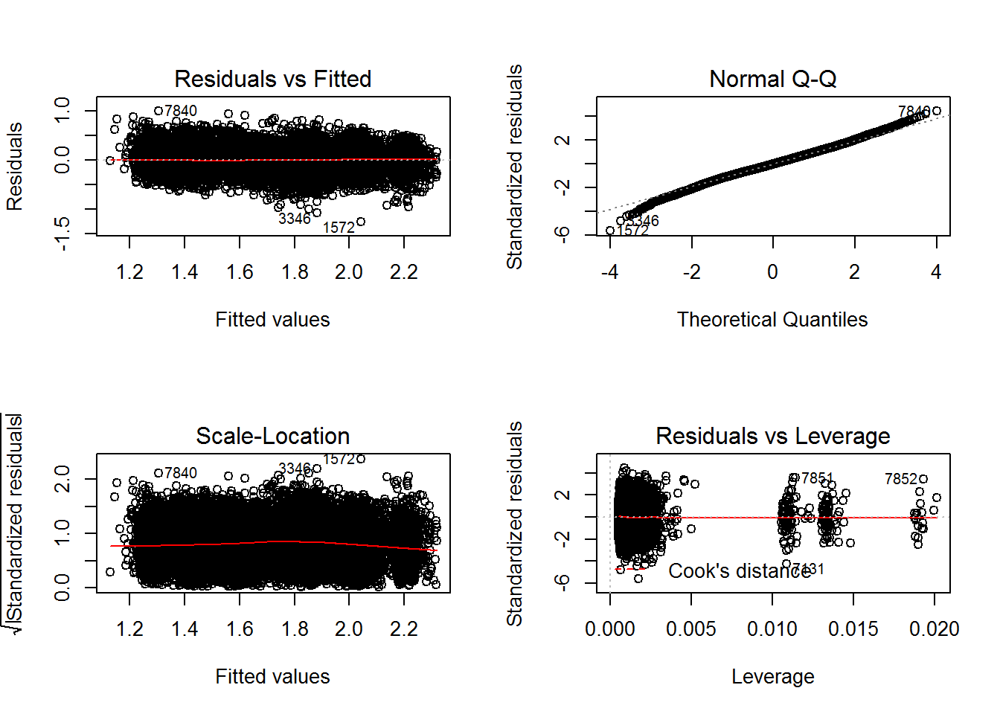


#### 对数线性模型：结果解读

与线性模型不同，对数线性模型的系数估计为“增长率”。控制其它因素不变时：

- **城区：**石景山区单位面积最低，西城区单位面积最高，比石景山平均贵62.8%
- **学区房**比非学区房单位面积房价平均贵17.32%
- **地铁房**比非地铁房单位面积房价平均贵13.09%
- **高层房屋**单位面积房价最低，其次是中层，低层房屋单位面积房价最高
- **卧室数**越多，房屋单位面积房价越高，其中4个卧室数相对3个卧室数来说平均贵4%
- **客厅数**越多，房屋单位面积房价越高，3个卧室比没有卧室平均贵15.4%
- **房屋面积**的增加会带来单位面积房价的降低

### 交互模型

根据前面描述性分析的结果发现，不同的城区、是否为学区房的房价有非常明显的差异。因此，在对数线性模型的基础之上，考虑更为复杂的情况：**城区和学区的交互作用**

```{r}
lm3.sol <- update(lm2.step, .~.+CATE_dc*school+CATE_ft*school+
                    CATE_hd*school+CATE_sjs*school+CATE_sc*school)
```

#### 回归诊断

```{r}
par(mfrow=c(2,2))
plot(lm3.sol)
```

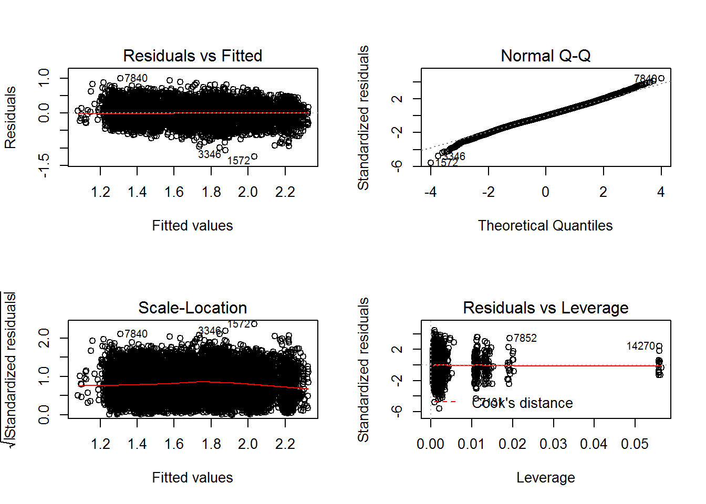

#### 模型改进：逐步回归法

```{r}
lm3.step <- step(lm3.sol)

## Start:  AIC=-48351.27
## log(price) ~ CATE_dc + CATE_ft + CATE_hd + CATE_sjs + CATE_sc + 
##     bedrooms3 + bedrooms4 + bedrooms5 + halls1 + halls2 + halls3 + 
##     AREA + floor_high + floor_medium + subway + school + CATE_dc:school + 
##     CATE_ft:school + CATE_hd:school + CATE_sjs:school + CATE_sc:school
## 
##                   Df Sum of Sq    RSS    AIC
## - CATE_ft:school   1     0.046 805.24 -48352
## <none>                         805.19 -48351
## - floor_medium     1     0.189 805.38 -48349
## - halls1           1     0.593 805.79 -48341
## - bedrooms5        1     0.723 805.92 -48339
## - bedrooms3        1     0.853 806.05 -48336
## - CATE_sjs:school  1     1.281 806.48 -48328
## - bedrooms4        1     1.398 806.59 -48325
## - halls3           1     1.701 806.90 -48319
## - CATE_dc:school   1     2.375 807.57 -48306
## - CATE_sc:school   1     2.397 807.59 -48305
## - floor_high       1     3.102 808.30 -48291
## - CATE_hd:school   1     3.522 808.72 -48283
## - halls2           1     8.833 814.03 -48177
## - AREA             1    11.557 816.75 -48123
## - subway           1    34.737 839.93 -47671
## 
## Step:  AIC=-48352.36
## log(price) ~ CATE_dc + CATE_ft + CATE_hd + CATE_sjs + CATE_sc + 
##     bedrooms3 + bedrooms4 + bedrooms5 + halls1 + halls2 + halls3 + 
##     AREA + floor_high + floor_medium + subway + school + CATE_dc:school + 
##     CATE_hd:school + CATE_sjs:school + CATE_sc:school
## 
##                   Df Sum of Sq    RSS    AIC
## <none>                         805.24 -48352
## - floor_medium     1     0.191 805.43 -48351
## - halls1           1     0.595 805.83 -48342
## - bedrooms5        1     0.719 805.96 -48340
## - bedrooms3        1     0.848 806.09 -48337
## - CATE_sjs:school  1     1.325 806.57 -48328
## - bedrooms4        1     1.389 806.63 -48327
## - halls3           1     1.693 806.93 -48320
## - CATE_dc:school   1     2.406 807.65 -48306
## - CATE_sc:school   1     2.427 807.67 -48306
## - floor_high       1     3.102 808.34 -48292
## - CATE_hd:school   1     3.634 808.87 -48282
## - halls2           1     8.828 814.07 -48178
## - AREA             1    11.531 816.77 -48125
## - subway           1    34.888 840.13 -47670
## - CATE_ft          1    36.726 841.97 -47634
```

```{r}
par(mfrow=c(2,2))
plot(lm3.step)
```

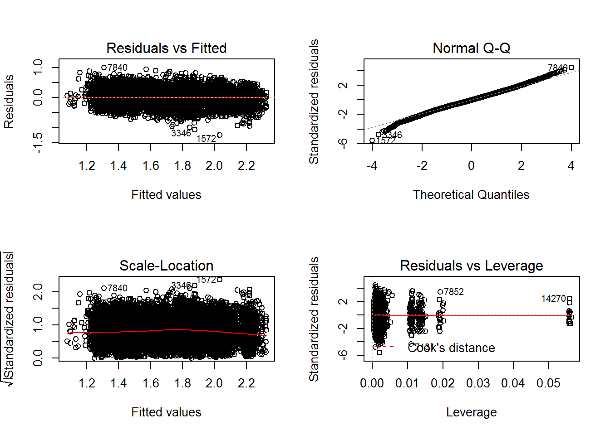

#### 方差分析

```{r}
library(car)
Anova(lm3.step)

## Anova Table (Type II tests)
## 
## Response: log(price)
##                 Sum Sq    Df   F value    Pr(>F)    
## CATE_dc          94.31     1 1888.1603 < 2.2e-16 ***
## CATE_ft          36.73     1  735.2620 < 2.2e-16 ***
## CATE_hd          73.88     1 1479.0712 < 2.2e-16 ***
## CATE_sjs         44.84     1  897.6179 < 2.2e-16 ***
## CATE_sc         227.31     1 4550.8267 < 2.2e-16 ***
## bedrooms3         0.85     1   16.9740 3.808e-05 ***
## bedrooms4         1.39     1   27.8021 1.361e-07 ***
## bedrooms5         0.72     1   14.4027 0.0001481 ***
## halls1            0.59     1   11.9039 0.0005616 ***
## halls2            8.83     1  176.7402 < 2.2e-16 ***
## halls3            1.69     1   33.8947 5.928e-09 ***
## AREA             11.53     1  230.8602 < 2.2e-16 ***
## floor_high        3.10     1   62.1112 3.452e-15 ***
## floor_medium      0.19     1    3.8155 0.0507979 .  
## subway           34.89     1  698.4602 < 2.2e-16 ***
## school           78.94     1 1580.4300 < 2.2e-16 ***
## CATE_dc:school    2.41     1   48.1709 4.055e-12 ***
## CATE_hd:school    3.63     1   72.7496 < 2.2e-16 ***
## CATE_sjs:school   1.33     1   26.5351 2.618e-07 ***
## CATE_sc:school    2.43     1   48.5902 3.277e-12 ***
## Residuals       805.24 16121                        
## ---
## Signif. codes:  0 '***' 0.001 '**' 0.01 '*' 0.05 '.' 0.1 ' ' 1
```

从前面的逐步回归法看到，`floor_medium`变量系数检验的显著性水平仍不理想，下面我们用`drop1`函数作进一步的逐步回归：

```{r}
drop1(lm3.step)
lm.opt <- update(lm3.step,.~.-floor_medium)
summary(lm.opt)

## 
## Call:
## lm(formula = log(price) ~ CATE_dc + CATE_ft + CATE_hd + CATE_sjs + 
##     CATE_sc + bedrooms3 + bedrooms4 + bedrooms5 + halls1 + halls2 + 
##     halls3 + AREA + floor_high + subway + school + CATE_dc:school + 
##     CATE_hd:school + CATE_sjs:school + CATE_sc:school, data = modeldata)
## 
## Residuals:
##      Min       1Q   Median       3Q      Max 
## -1.25249 -0.14243 -0.00292  0.14499  0.99813 
## 
## Coefficients:
##                   Estimate Std. Error t value Pr(>|t|)    
## (Intercept)      1.5363678  0.0111059 138.338  < 2e-16 ***
## CATE_dc          0.2438775  0.0074800  32.604  < 2e-16 ***
## CATE_ft         -0.1674891  0.0061746 -27.126  < 2e-16 ***
## CATE_hd          0.2030225  0.0074323  27.316  < 2e-16 ***
## CATE_sjs        -0.2075007  0.0071020 -29.217  < 2e-16 ***
## CATE_sc          0.4086254  0.0080895  50.513  < 2e-16 ***
## bedrooms3        0.0203012  0.0049469   4.104 4.08e-05 ***
## bedrooms4        0.0603269  0.0114299   5.278 1.32e-07 ***
## bedrooms5        0.0926816  0.0243344   3.809 0.000140 ***
## halls1           0.0288778  0.0083845   3.444 0.000574 ***
## halls2           0.1312380  0.0098814  13.281  < 2e-16 ***
## halls3           0.1583450  0.0270240   5.859 4.74e-09 ***
## AREA            -0.0010657  0.0000703 -15.159  < 2e-16 ***
## floor_high      -0.0299429  0.0037232  -8.042 9.44e-16 ***
## subway           0.1286921  0.0048696  26.428  < 2e-16 ***
## school           0.1008752  0.0094247  10.703  < 2e-16 ***
## CATE_dc:school   0.0883147  0.0127136   6.946 3.89e-12 ***
## CATE_hd:school   0.1071068  0.0125603   8.527  < 2e-16 ***
## CATE_sjs:school -0.2772255  0.0537888  -5.154 2.58e-07 ***
## CATE_sc:school   0.0888724  0.0127989   6.944 3.96e-12 ***
## ---
## Signif. codes:  0 '***' 0.001 '**' 0.01 '*' 0.05 '.' 0.1 ' ' 1
## 
## Residual standard error: 0.2235 on 16122 degrees of freedom
## Multiple R-squared:  0.6206, Adjusted R-squared:  0.6201 
## F-statistic:  1388 on 19 and 16122 DF,  p-value: < 2.2e-16
```

####  模型的确立

在此之前，我们共建立了`lm1.sol`，`lm2.sol`，`lm2.step`，`lm3.sol`，`lm3.step`和`lm.opt`共六个线性模型。下面我们使用AIC或BIC进行模型选择：

```{r}
AIC(lm1.sol,lm2.sol,lm2.step,lm3.sol,lm3.step,lm.opt)

##          df       AIC
## lm1.sol  19 56975.812
## lm2.sol  19 -2421.835
## lm2.step 18 -2422.436
## lm3.sol  23 -2540.260
## lm3.step 22 -2541.345
## lm.opt   21 -2539.525
```

```{r}
BIC(lm1.sol,lm2.sol,lm2.step,lm3.sol,lm3.step,lm.opt)

##          df       BIC
## lm1.sol  19 57121.907
## lm2.sol  19 -2275.740
## lm2.step 18 -2284.031
## lm3.sol  23 -2363.409
## lm3.step 22 -2372.183
## lm.opt   21 -2378.052
```

最终，我们选择`lm.opt`模型作为“最优”模型.

#### 交互模型：结果解读

- 石景山与学区交互的系数估计为负数：学区房比非学区房的单位面积房价低(`CATE_sjs*school`前面的系数为-0.28)
- 数据原因：来自石景山区的样本中，学区房比例极低

```{r}
library(dplyr)
options(digits = 2)
prop <- dat %>% group_by(CATE) %>%
        summarize(n=length(school),p=(prop.table(table(school))*100)[2]) %>%
        arrange(p)
colnames(prop) <- c('学区','样本量','学区房占比(%)')
prop

## Source: local data frame [6 x 3]
## 
##     学区 样本量 学区房占比(%)
##   <fctr>  <int>         <dbl>
## 1 石景山   1936          0.93
## 2   丰台   2938          3.20
## 3   朝阳   2864         20.84
## 4   东城   2768         45.88
## 5   海淀   2917         47.48
## 6   西城   2719         56.68
```

- 客观原因：石景山区的学区资源在六个城区中相对较差

```{r}
par(mfrow=c(2,3))
boxplot(price~school,data=dat[dat$CATE=="石景山",],main="石景山区")
boxplot(price~school,data=dat[dat$CATE=="丰台",],main="丰台")
boxplot(price~school,data=dat[dat$CATE=="朝阳",],main="朝阳")
boxplot(price~school,data=dat[dat$CATE=="东城",],main="东城")
boxplot(price~school,data=dat[dat$CATE=="海淀",],main="海淀")
boxplot(price~school,data=dat[dat$CATE=="西城",],main="西城")
```

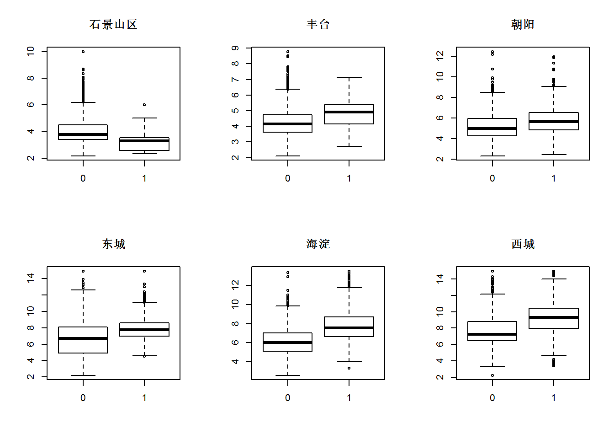

- 整体而言(不考虑学区因素)，西城区与海淀区的单位面积房价之比

    - 对数线性模型：

	```{r}
	exp(0.433-0.235)

	[1] 1.218962
	```
    
- **学区房房价哪家强？**

    - 学区房：西城区与海淀区的单位面积房价之比
        - 交互模型：
        ```{r}
		exp(0.408+0.088-0.203-0.107)
		
		[1] 1.204422
		```
    - 非学区房：西城区与海淀区的单位面积房价之比
        - 交互模型：
        ```{r}
		exp(0.408-0.203)
		
		[1] 1.227525
		```
        
- 结论：交互模型能发现更多信息！

### 预测

假想：一家三口，为了孩子在西城区上学，想买一套临近地铁的两室一厅学区房，面积是85平方米，中等楼层


```{r}
options(digits = 3)
n1 <- modeldata[1,]
x_new <- n1[,-18]
x_new[1,] <- c(0,0,0,0,1,1,0,0,0,1,0,0,85,0,1,1,1)
price <- predict(lm.opt,x_new)
exp(price)

##    1 
## 9.04
```

根据交互模型，预测的单位面积房价是9.04万元/平方米，总价768.4万元

## 结论和建议

1. 影响北京市二手房单位面积房价的主要因素有：

    - 区位因素：城区、地铁、学区
    - 内部因素：卧室数、客厅数、面积、楼层

2. 使用对数线性模型，可以克服数据中存在的异方差问题
3. 使用交互模型，能带来更好的模型解读

    - “学区优势”对各城区单位面积房价的影响有所区别
    
## 模型扩展

1. 房价的影响因素众多，应在模型中加入更多因素：

    - 小区位置(如：地处几环？)
    - 小区环境(如：绿化情况)
    - 周边配套(如：商圈、医院等)
    - .......
2. 各城市情况不一致，需要进一步考虑城市特有因素