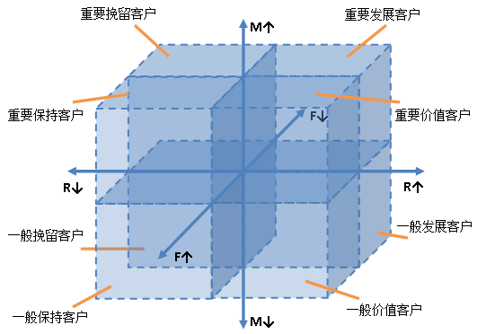
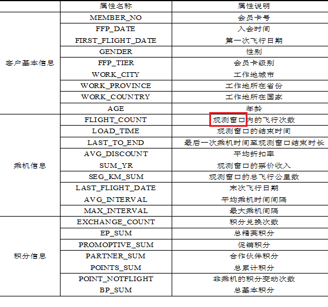
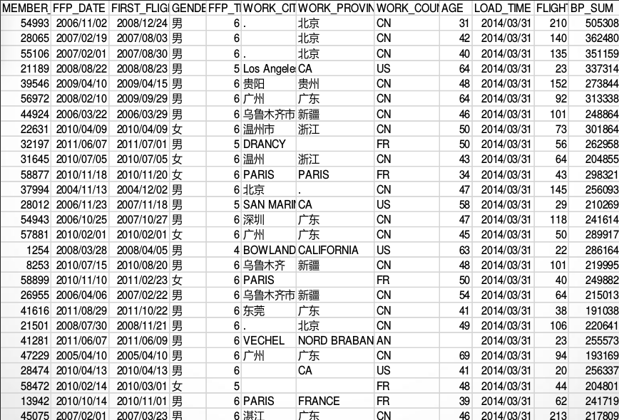
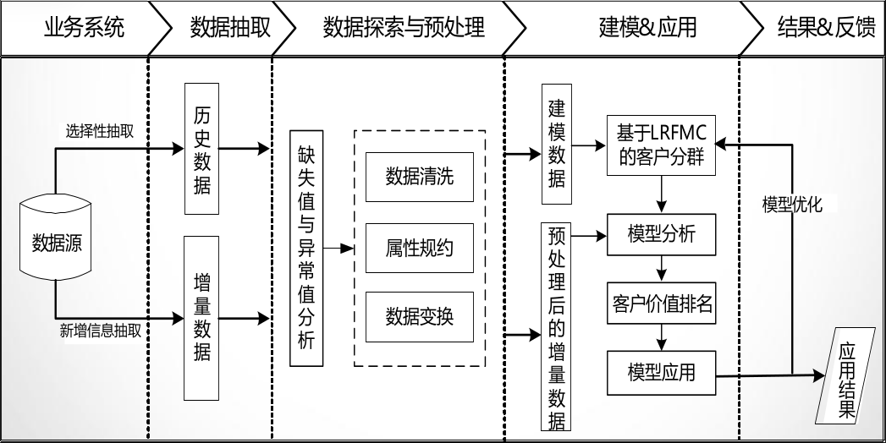
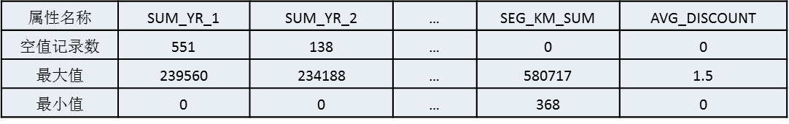
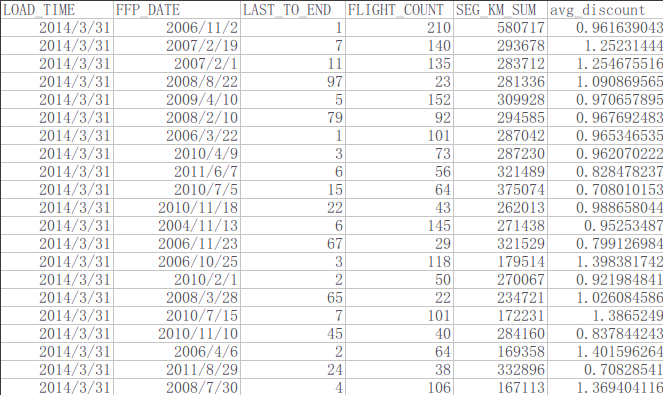
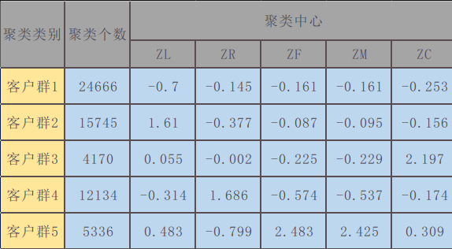
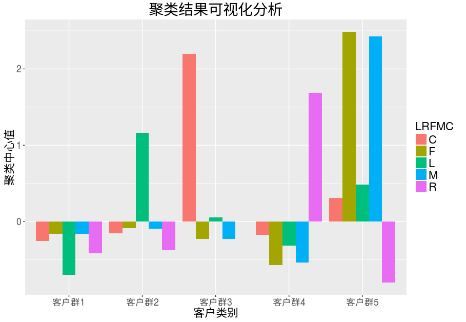
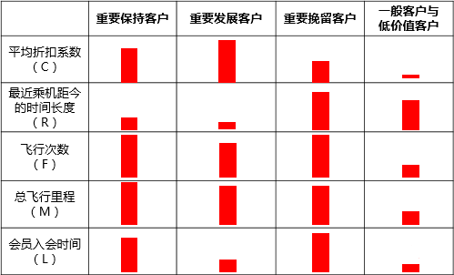

##　案例背景

- 二八定律：20%的客户，为企业带来约80%的利益
- 在企业的客户关系管理中，对客户分类，区分不同价值的客户。针对
不同价值的客户提供个性化服务方案，采用不同营销策略，将有限营销资源集中于高价值客户，实现企业理论最大化目标。
- 在竞争激烈的航空市场里，很多航空公司都推出了优惠的营销方式来吸引更多的客户。在此种环境下，如何将公司有限的资源充分利用，提高企业竞争力，为企业带来更多的利益。

## 传统方法存在的缺陷

- 广泛用于分析客户价值的是RFM模型,它是通过三个指标(最近消费时间间隔(Recency)、消费频率(Frequency)、消费金额(Monetary))来进行客户细分,识别出高价值的客户。如果分析航空公司客户价值,此模型不再适用,存在一些缺陷和不足:
    1. 在模型中,消费金额表示在一段时间内,客业产品金额的总和。因航空票价受到运输距离、舱位等级等多种因素影响,同样消费金额的不同旅客对航空公司的价值是不同的。因此这个指标并不适合用于航空公司的客户价值分析。
    2. 传统模型分析是利用属性分箱方法进行分析，如下图。但是此方法细分的客户群太多,需要一一识别客户特征和行为,提高了针对性营销的成本。
    
  
    
## 原始数据情况

- 客户信息属性说明，针对航空客户的信息，对每个属性进行相应说明。

**观测窗口：**以过去某个时间点为结束时间，某一个时间长度作为宽度，得到历史时间范围内的一个时间段。

- 航空客户信息数据，其中已经包含会员档案信息和其乘坐航班记录等。

## 挖掘的目标

- 借助航空公司客户数据，对客户进行分类；
- 对不同的客户类别进行特征分析，比较不同类别客户的客户价值；
- 对不同价值的客户类别提供个性化服务，制定相应的营销策略；

## 分析方法与过程

初步分析：提出适合航空公司的LRFMC模型

- 因消费金额指标在航空公司中不适用,故选择客户在一定时间内累积的飞行里程M和客户乘坐舱位折扣系数的平均值C两个指标代替消费金额。此外,考虑航空公司会员加入时间在一定程度上能够影响客户价值,所以在模型中增加客户关系长度L,作为区分客户的另一指标,因此构建出LRFMC模型。
- 采用聚类的方法对客户进行细分,并分析每个客户群的特征,识别其客户价值。

## 总体流程

## 分析方法与过程

### 第一步：数据抽取

- 以2014-03-31为结束时间,选取宽度为两年的时间段作为分析观测窗口,抽取观测窗口内有乘机记录的所有客户的详细数据形成历史数据。对于后续新增的客户详细信息,利用其数据中最大的某个时间点作为结束时间,采用上述同样的方法进行抽取,形成增量数据。
- 根据末次飞行日期,从航空公司系统内抽取2012-04-01至2014-03-31内所有乘客的详细数据,总共62988条记录。

### 第二步：探索分析

- 原始数据中存在票价为空值,票价为空值的数据可能是客户不存在乘机记录造成。
- 价最小值为0、折扣率最小值为0、总飞行公里数大于0的数据。其可能是客户乘坐0折机票或者积分兑换造成。

### 第三步：数据预处理
1. 数据清洗：从业务以及建模的相关需要方面考虑,筛选出需要的数据
    - 丢弃票价为空的数据。
    - 丢弃票价为0、平均折扣率不为0、总飞行公里数大于0的数据。
2. 属性规约:原始数据中属性太多,根据LRFMC模型,选择与其相关的六个属性,删除不相关、弱相关或冗余的属性。

3. 数据变换  
    - **属性构造：**原始数据中并没有直接给出LRFMC五个指标,需要构造这五个指标
    - **数据标准化：**因五个指标的取值范围数据差异较大，为了消除数量级数据带来的影响,需要对数据进行标准化处理。

| 属性名称 | 含义 |
| :---: | :---: |
| L=LOAD_TIME-FFP_DATE | 会员入会时间距观测窗口结束的月数 = 观测窗口的结束时间-入会时间[单位:月] |
| R=LAST_TO_END | 客户最近一次乘坐公司飞机距观测窗口结束的天数 = 最后一次乘机时间至观察窗口末端时长[单位：天] | 
| F=FLIGHT_COUNT | 客户在观测窗口内乘坐公司飞机的次数 = 观测窗口的飞行次数 |
| M=SEG_KM_SUM | 客户在观测时间内在公司累计的飞行里程 = 观测窗口总飞行公里数 |
| C=AVG_DISCOUNT | 客户在观测时间内乘坐舱位所对应的折扣系数的平均值 = 平均折扣率 |  

| 属性名称 | L | R | F | M | C |
| :------- | :---: | :---: | :---: | :---: | :---: |
|  最小值  | 12.17 | 1.0  |   2   |  368  |  0 |
|  最大值  | 114.57 | 731 | 213 | 580717 | 1.5   |

## 分析方法与过程

### 第五步：构建模型

#### 客户k-Means聚类

采用K-Means聚类算法对客户数据进行分群,将其聚成五类(需要结合业务的理解与分析来确定客户的类别数量)。客户聚类结果如下表格：

#### 客户价值分析

- 对聚类结果进行特征分析,其中客户群5在F、M属性最大,在R属性最小;客户群2在L属性上最大;客户群4在R属性上最大,在F、M属性最小;客户群1在L、C属性上最小;客户群3在C属性上最大。

- 根据业务定义五个等级的客户类别:重要保持客户、重要发展客户、重要挽留客户、一般客户、低价值客户。

- 客户群价值排名:根据每种客户类型的特征,对各类客户群行客户价值排名,获取高价值客户信息。

| 客户类别 | 排名 | 排名含义 |
| :----:   | :---: | :---: |
| 客户群5 | 1 | 重要保持客户 |
| 客户群3 | 2 | 重要发展客户 | 
| 客户群2 | 3 | 重要挽留客户 |
| 客户群1 | 4 | 一般客户 | 
| 客户群4 | 5 | 低价值客户 | 

####　模型应用

根据各个客户群的特征,可采取一些营销手段和策略。如：

1. 会员的升级与保级
2. 首次兑换
3. 交叉销售
