## 大纲

- 背景介绍
- 数据介绍与说明
- 数据描述
- 数据建模
- 出险因素模型的商业化应用

## 车险行业蓬勃发展

- 车险产品定价因素
    - 车因素：车型、车龄等
    - 人因素：驾驶人年龄、性别、驾龄、婚姻状况等
    - 环境因素：天气、路况
  
- 车联网行业发展，产生大量驾驶行为数据

## 背景介绍

- UBI(Usage Based Insurance)
    - 基于驾驶人行为的车险产品
  
- 国外现状
    - Progressive,State Farm,Insure the Box等保险公司先后推出各类基于驾驶行为折扣保费和UBI保险产品
- 国内的UBI模式车险业务尚处于探索阶段，但已具备推出的基础

## 数据来源

- 数据来自某保险公司
- 因变量：某年度车险理赔金额
    - 理赔金额=0，代表当年没有出现
    - 理赔金额>0，代表实际出现金额
- 将因变量转换为0-1变量：某年度是否出险
- 自变量：汽车因素和驾驶人因素，共10个
- 样本量：n=4233辆车

## 数据说明（１）

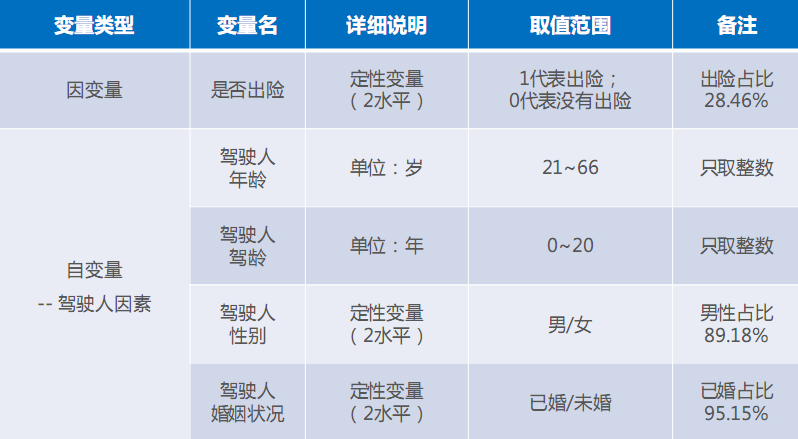

## 数据说明（２）

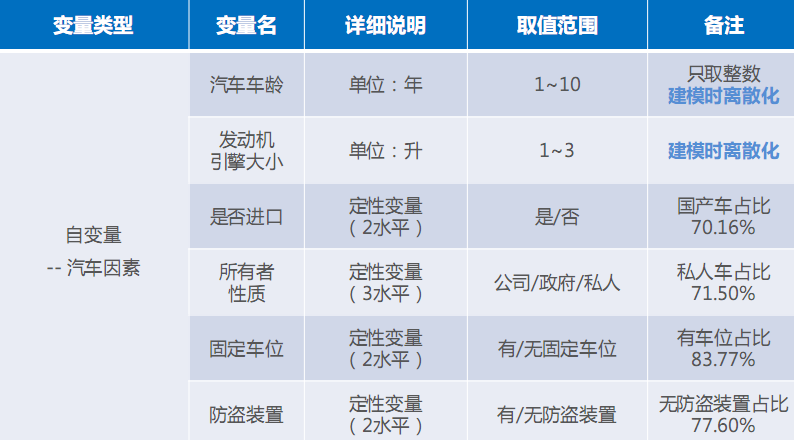

## 数据描述与建模

- 驾驶人因素
- 汽车因素
- 出险因素探究：0-1回归建模

## 自变量：驾驶人因素

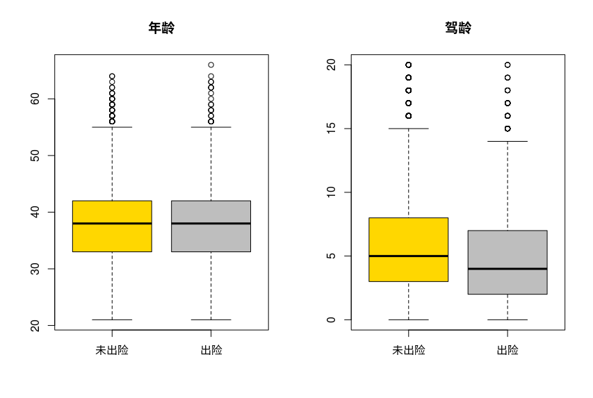

- 出险和未出险驾驶人年龄的平均水平（中位数）差异并不明显
- 出险驾驶人的**驾龄**平均水平（中位数）要明显低于未出险的驾驶人

## 自变量：驾驶人因素

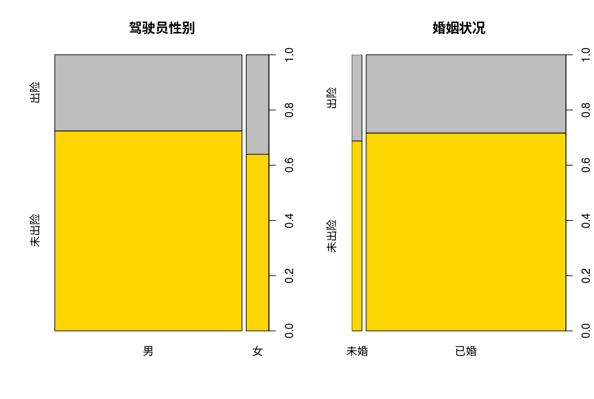

- 女性驾驶人出险比例更高，样本量小于男性驾驶人
- 未婚驾驶人出险比例略高，样本量远小于已婚驾驶人

## 自变量：汽车因素

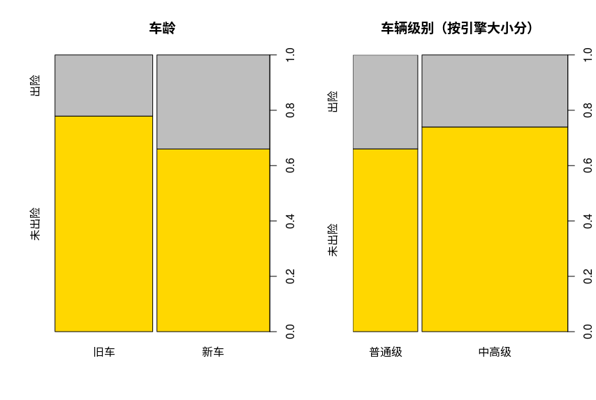

- 新车出险率更高
    - 年龄变量被离散化：
    - 年龄=1年 -> 新车
    - 年龄>1年 -> 旧车
    
- 普通级车辆车险率更高
    - 引擎大小被离散化处理：
    - 引擎<=1.6L　-> 普通级
    - 引擎>1.6L   -> 中高级
    
## 自变量：汽车因素

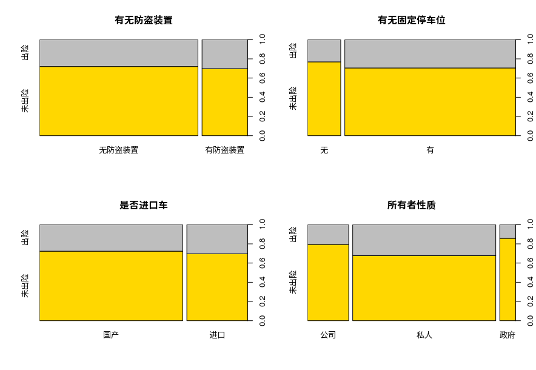

- 有防盗装置、有固定车位、进口车以及私人车的出险率略高
- 注意：在有无防盗装置、有无固定车位、是否进口车和所有者性质的不同水平之间，样本量的分布不均匀

## Logistic回归模型－－全模型

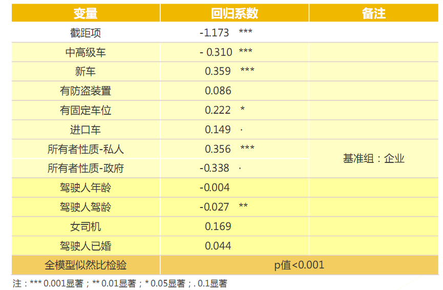

## AIC模型和BIC模型

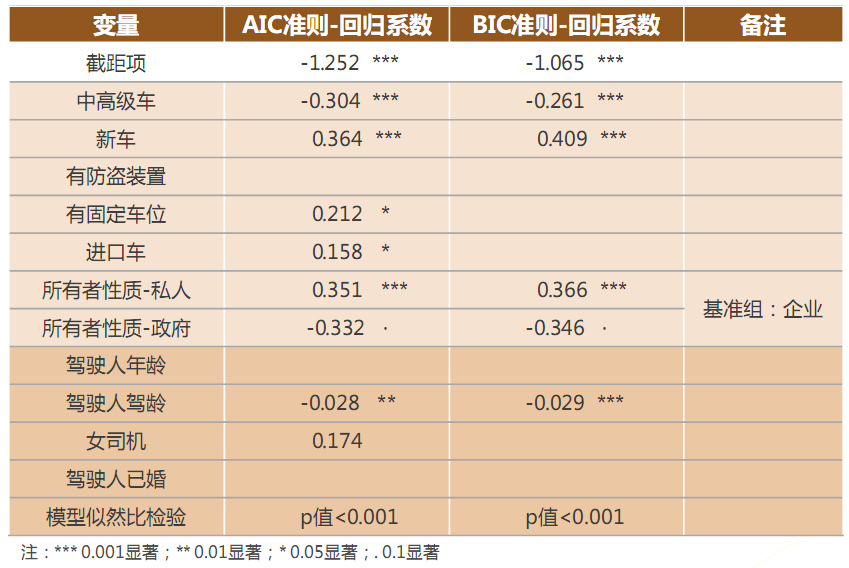

## 模型选择

- 全模型
- AIC模型
- BIC模型

## ROC曲线

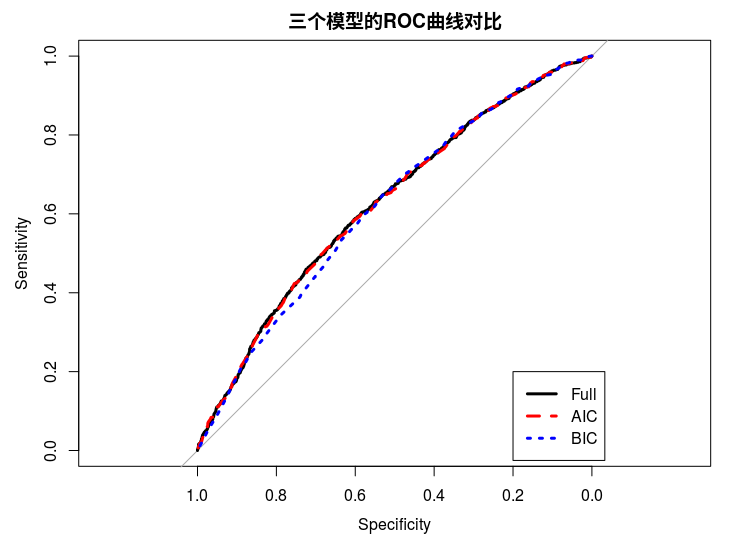

- 预测精度的评价标准：AUC值（AUC是ROC曲线下方的面积，反应模型的预测精度）
    - 全模型：0.6253
    - AIC模型：0.6241
    - BIC模型：0.6177
    
- 综合考虑模型的预测精度和复杂程度，选择**AIC**模型

## AIC模型解读

- 哪些因素与出险行为高度相关？（回归系数的显著性检验）
    - 汽车因素：车辆级别、车龄、有无固定车位、是否进口车、所有车性质
    - 驾驶人因素：驾龄
    
- 注意：这里关注的是发生出险行为的可能性，而非发生事故的可能性

## AIC模型解读

- 汽车因素：
    - 车辆级别：普通级车（引擎<=1.6L）更可能车险
    - 车龄：新车（车龄=1年）更可能车险
    - 有无固定车位：有固定车位的车更可能出险
    - 是否进口车：进口车比国产车更可能出险
    - 所有者性质：私人车更可能出险
    
- 驾驶人因素：
    - 驾驶人驾龄：驾龄越大，越不可能出险

## 可能出险的车辆有如下特征

1. 新手司机
2. 私家车
3. 进口车
4. 普通级车（排量<=1.6L）
5. 新车（车龄1年）
6. 有固定停车位

## ROC曲线和最佳阈值

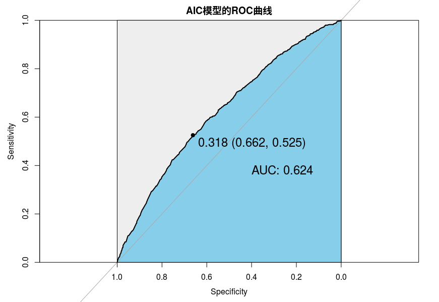

- 预测的最佳阈值p0=0.318
    - 预测概率>=p0，预测为出险
    - 预测概率<p0，预测为未出险
- 预测阈值的选择标准
    - 平衡TPR和FPR
- 在实际数据分析中，也可考虑使用样本出险率作为阈值

## 混淆矩阵（在最佳阈值情况下）

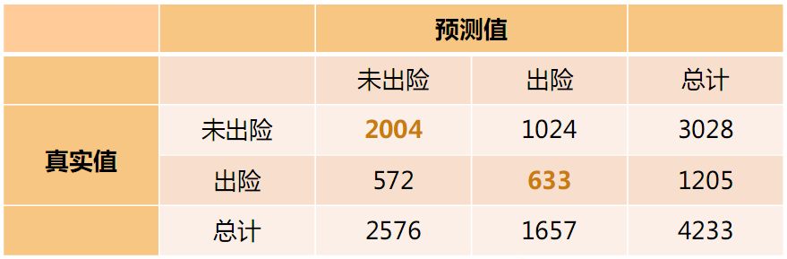

- 整体错判率：(1024+572)/4233 = 37.7%
- TPR：633/1205 = 52.5%
- FPR：1024/3028 = 33.8%
- Sensitivity = TPR = 52.5%
- Specificity = 1 - FPR = 66.2%

## 商业应用1：个性化车险产品

- 根据出险因素模型，制定个性化车险产品
- 根据影响出险的显著因素（如年龄、驾龄），制定个性化的车险保费
- 进一步结合驾驶行为数据，制定基于驾驶行为的UBI车险

## 商业应用2：人群细分

1. 按照AIC模型的预测出险概率进行从高到低排序
2. 将排序后的驾驶人等分为5份，代表高风险、偏高、中等、偏低、低风险5种不同风险人群
3. 考察这5种人群的实际出险概率
- 模型识别的低风险人群：
    - 占总人群的20%
    - 实际出险率只有17%，而样本的整体出险率为28%
    
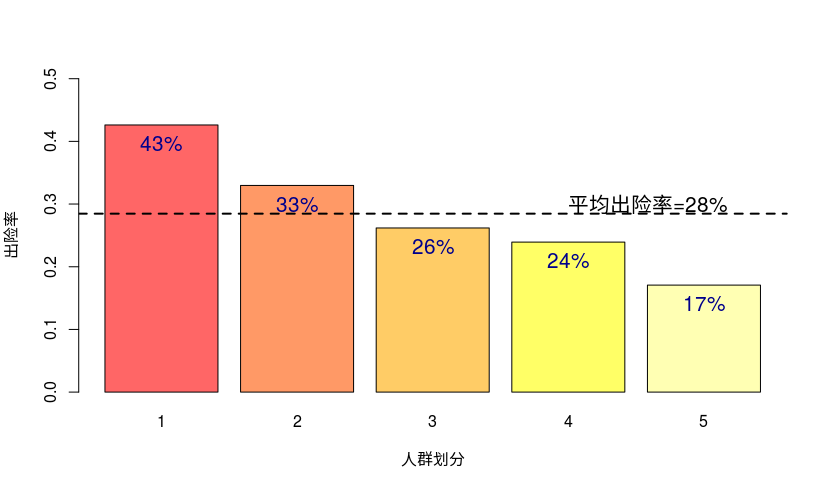

## 未来研究方向

- 本案例的结论基于内样本，会高估模型的预测精度
- 考虑驾驶行为的数据，定制基于驾驶行为的UBI产品
- 结合出险险种等数据，预测出险金额

